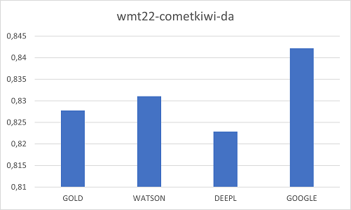

# 1 MTEvalPoC - Machine Translation evaluation examples (BLEU,  SBERT, COMET...)

## 1.2 Intro
We want to evaluate the quality of 3 machine translations (MT) systems: Google Translator MT,
DeepL MT and Watson MT, based on human translation (HT), but also without human translation. 

This evaluation is based on aprox 8500 words extracted from an IBM online help, that was
human translated (8 years ago based, very probably with some RNN or statistical MT)). So,
be aware, human translations probably will be biased to Watson MT (from IBM). There will be 3 MT translations 
for Watson, DeepL and Google.  The exercise here to explain how to reach "actual" results.

Probably more data should be need it and data probably verified, but looks like
all MT provide similar values according standard metrics.
 
 
 ## 1.3 Files 
 
 - ra_source.txt (Source file) : (46 lines aprox, 8500 words (sentences with medium length and NO tags (originally dita files))
- ra_target.txt (Target translation in Spanish) (Human translation based on IBM's MT available at the time. 8 years ago)
- ra_target_google.txt (MT for Google Translator)  (Translated from the public Google Translator )
- ra_target_deepl.txt (MT for DeepL) (translated from the public DeepL)
-  ra_target_watson.txt (Translated with Watson MT)

## 1.4 1st test -  MT evaluation vs human translation (HT) (BLEU SCORE)
We will use the BLEU score, one of the most widely used.  For reference:
100 - MT matches reference 
90 -  MT is close to human translations
60 - MT can be used by a translator 
Results of HT(human translation) vs MT systems:

| Model | BLEU|
| :---:   | :---: |
| Google  | 58.07 |
| DeepL  | 57.84 |
| Watson | 68.88 |

a) Watson MT is significantly better, (10 points better), but probably because the HT is based in a previous IBM RNN MT 
used 8 years ago. 

b) MT quality probably is "low" based on current translations (many times, scores > 80) , but (IMHO)  probably because current
 translator pay models tend to penalize changes in MT proposals and set as "correct" translations that in the past were "changed".

 ### Tech notes

- Most of the BLEU score are based in tokenized strings.
- There are several BLEU score implementations (BLEU4Python ( https://github.com/zhyack/BLEU4Python ) (Note that files need to be tokenized), OpenMT (from MOSES), sacremoses, blue package, ...)

## 1.5 2nd test -  Cross-Lingual Similarity Estimation of MT proposals using a Hugging Face Sentence-BERT models

Many times we do not have a human translation, so we cannot verify the MT quality. 
One line of work has been based on the sentence encoding (using sentence encoders).  An encoder maps sentences with vectors. Sentences with similar representation vectors, are similar (semantically) .  Based on this idea, there is BERTScore, based on transformer BERT language models, that can be trained or distilled to create agnostic language embedding, and then use cousins similarity to compare the sentences.  

The SBERT.net (https://www.sbert.net/docs/pretrained_models.html) provides a list of some models we can use, All the ones with "multilingual" are able to be used,  In Hugging Face (https://huggingface.co/sentence-transformers) there is even a larger list).   You can easily create some python implementation.  Here, paraphrase-xlm-r-multilingual-v1, based in xml-RoBERTa, a model well know for agnostic language embbeding. 
paraphrase-xlm-r-multilingual-v1

| Model | Mean| Std Dev |
| :---:   | :---: |:---: |
| GOLD  | 0.8753 | 0.0801 |
| WATSON  | 0.8859 | 0.0760 |
| DEEPL  | 0.8664 |0.1471 |
| GOOGLE | 0.8960 | 0.0707 |

a) Graph is somehow misleading, notice how numeric results are very similar, if we take in account 95% certainty (2 x std.dev), none is better than other.
b) Very interesting though that the GOLD translation (human verified translation) is NOT chosen as the best one, probably because of  a)

## 1.6 3rd test -  COMET using model WITH  references (Unbabel/wmt22-comet-da)

COMET is being used by Microsoft as main MT metric. Somehow a black box. 

Paper -> COMET: A Neural Framework for MT Evaluation (https://arxiv.org/pdf/2009.09025.pdf)

Implementation based on -> https://github.com/Unbabel/COMET

Results for Unbabel/wmt22-comet-da (also based on XLM-RoBERTa ) using human translation as reference

| Model | Mean| Std Dev |
| :---:   | :---: |:---: |
| WATSON  | 0.9143 | 0.0596 |
| DEEPL  | 0.8840 | 0.1008 |
| GOOGLE | 0.8977 | 0.0612 |

a) Results are also very close, but notice how Watson MT is on first place (I would expect that as human reference
is based in an human translation based on an old IBM model ).

## 1.7 4rd test -  COMET using model WITHOUT  references (Unbabel/wmt22-cometkiwi-da)

**NOTE: This model is not suitable for commercial purposes an requires
huggin face login (you need to create a tooken)**

Results for Unbabel/wmt22-cometkiwi-da WIHTOUT human translation as reference.
Also you can evalutate the actual translation. Also notice how actual translation
is not selected as the best one.

| Model | Mean| Std Dev |
| :---:   | :---: |:---: |
| GOLD  | 0.8277 | 0.0626 |
| WATSON  | 0.8310 | 0.0655 |
| DEEPL  | 0.8228 | 0.1036 |
| GOOGLE | 0.8421 | 0.0490 |

a) Results are also very close, but notice how Watson MT is on first place (I would expect that as human reference
is based in an human translation based on an old IBM model ).

## 1.8 Referenceless systems (COMET vs SBERT)

Last intersting note, how COMET and SBERT, normalizing to 1, provide
very similar results (selecting GOOGLE as best, WATSON and GOLD similar and DEEPL
worsts

## 1.9 Other references

BLUE score from multi-bleu-detok.perl in OpenNMT (from Moses) -> https://github.com/OpenNMT/OpenNMT-py

BLEU scacremoses (python package) -> https://github.com/alvations/sacremoses

BLUE bleu package  -> https://github.com/zhijing-jin/bleu
